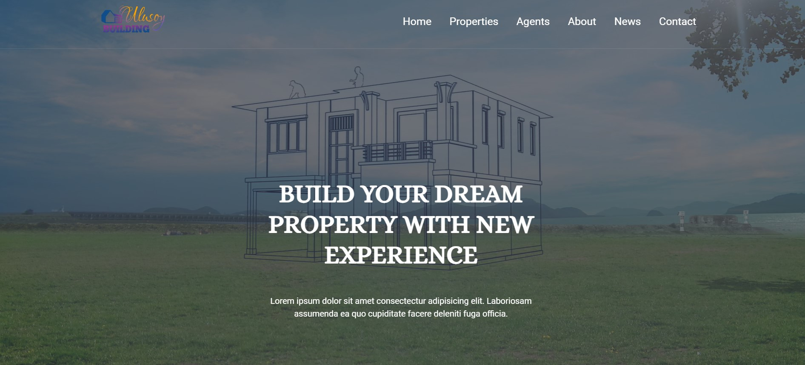

# JS-Project-4- Build a Real Estate Web Page

##JS eğitiminde hazırlanmış projedir.

# "Build a Real Estate Web Page" html-css-JS yapı ile oluşturulmuştur.

### udemig ödev çalışmasıdır...

### Bu çalışma toogle navbar,
### navbar animasyonu,
#### backround image animasyon,
#### slider çalışması içermektedir.

# JS-Project-4- Build a Real Estate Web Page
# JSProject-4-Build-Real-Estate-Web-Page
